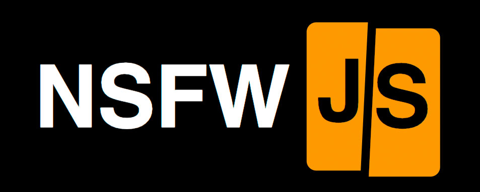
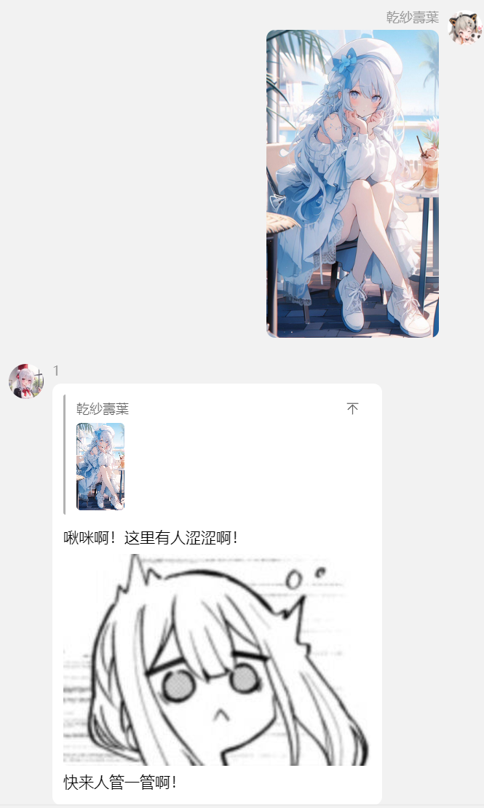
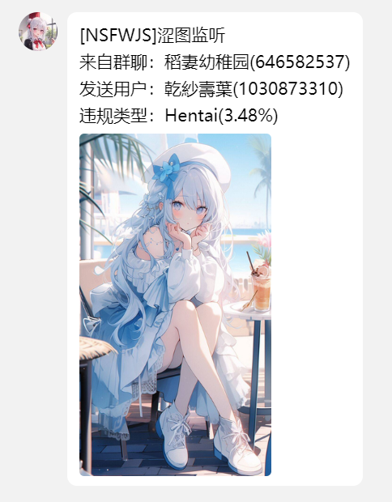
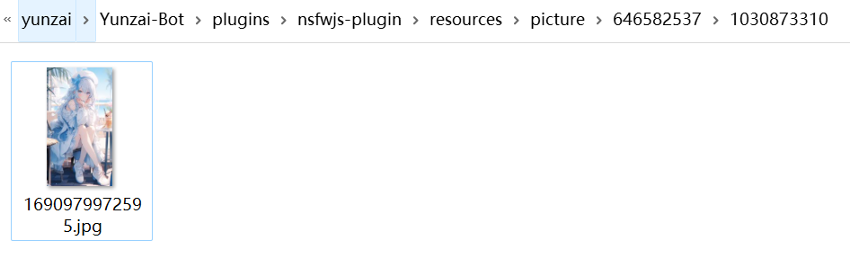

<p align="center">
  <a href="https://ap-plugin.com/"></a>
</p>

<div align="center">

# NSFWJS-PLUGIN

_🎉 基于 Yunzai-Bot 的 涩图监听 插件 🎉_

</div>


---

<span id="header"></span>

<p align="center">
  
  
  <br>
  </a>
    <a href="https://qm.qq.com/q/RnQteOmD84">
    
  </a>
</p>

<p align="center">
  <a href="https://gitee.com/CikeyQi/nsfwjs-plugin">项目地址</a>
  ·
  <a href="#安装插件">开始使用</a>
  ·
  <a href="#相关设置">相关设置</a>
</p>

## 简介

NSFWJS-Plugin 是一款在 QQ 内快速调用[NSFWJS](https://github.com/infinitered/nsfwjs)进行违规图像识别的[Yunzai-Bot](https://github.com/Le-niao/Yunzai-Bot)插件，本插件功能不断完善中，更多功能敬请期待……

<br>

## 安装插件

#### 1. 挂载至 Yunzai-Bot 目录

```
cd Yunzai-Bot
```

#### 2. 克隆本仓库至 plugins 目录

- 使用 Gitee（国内服务器推荐使用此方法）

```
git clone https://mirror.ghproxy.com/https://github.com/CikeyQi/nsfwjs-plugin.git ./plugins/nsfwjs-plugin
```

- 使用 Github

```
git clone https://github.com/CikeyQi/nsfwjs-plugin.git ./plugins/nsfwjs-plugin
```

#### 3. 安装依赖

```
cd ./plugins/nsfwjs-plugin && pnpm install
```

#### 4. 重启 Yunzai

```
pnpm restart
```

<br><br>

## 相关设置

插件安装完成后第一次使用，需配置通知的QQ号，支持配置多个QQ号

对机器人使用命令`#NSFWJS添加通知用户[你的QQ号]`

更多配置项可对机器人发送`#NSFWJS帮助`

查看当前群或默认群配置可对机器人发送`#NSFWJS查看(本群|全局)设置`

<br><br>

## 功能演示

### 违规图片警告

<p>
  </a>
    
  </a>
</p>

### 违规图片通知主人

<p>
  </a>
    
  </a>
</p>

### 违规图片保存本地
默认位置在`./plugins/nsfwjs-plugin/resources/picture/`，可自行配置

<p>
  </a>
    
  </a>
</p>

<br><br>

## 致谢

[NSFWJS](https://github.com/infinitered/nsfwjs)：提供了强大的图像识别模型与快捷的调用方法

## 声明

此项目仅用于学习交流，请勿用于非法用途

### 爱发电

如果你喜欢这个项目，请不妨点个 Star🌟，这是对开发者最大的动力  
当然，你可以对我爱发电赞助，呜咪~❤️

<details>
<summary>展开/收起</summary>

<p>
  </a>
    
  </a>
</p>

</details>

## 我们

<a href="https://github.com/CikeyQi/nsfwjs-plugin/graphs/contributors">
  
</a>
